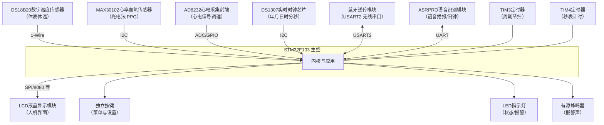
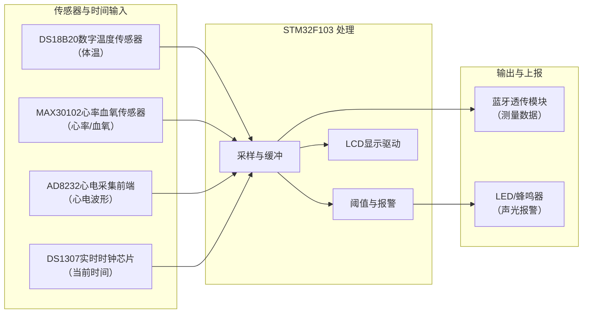
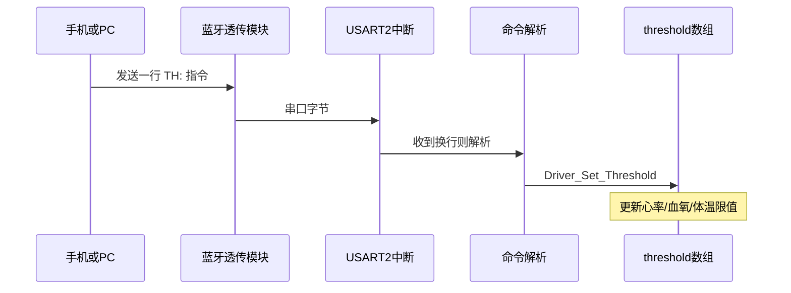
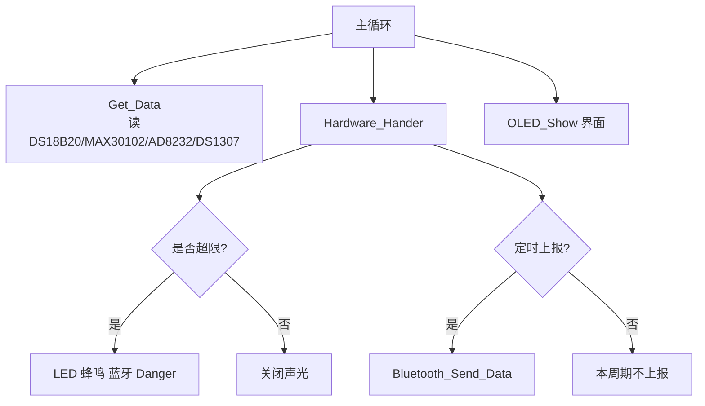
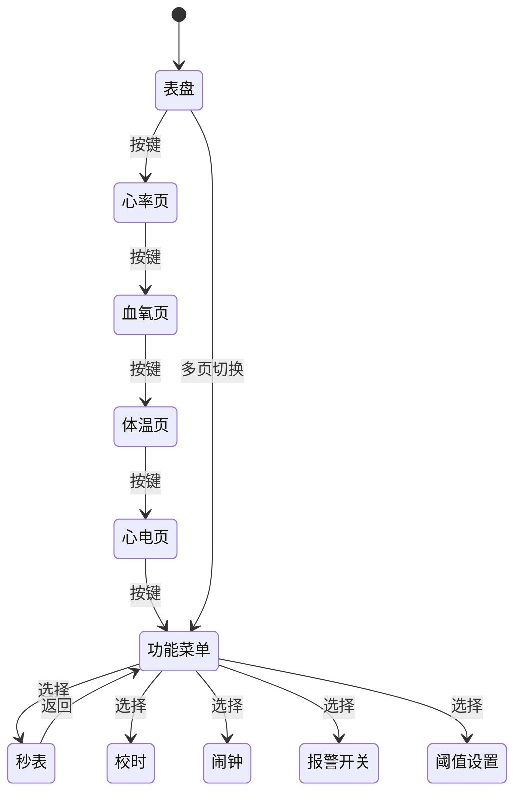
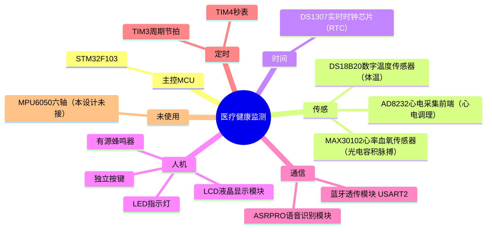
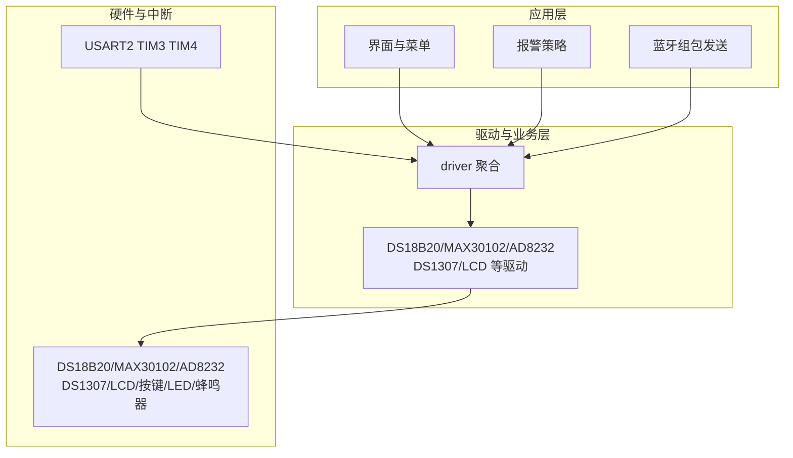

# 框图代码（分段复制）

与工程器件一致，节点采用 **「型号 + 作用」**（例：DS18B20数字温度传感器）。本设计**未使用 DHT11、未接 MPU6050**。每一段可单独复制到 [Mermaid Live](https://mermaid.live)。

---

## 第 1 段 — 硬件拓扑（flowchart TB）

**用途**：展示 MCU 与外设连接关系。

---

## 第 2 段 — 数据流（flowchart LR）

**用途**：从左到右表示数据走向。

---

## 第 3 段 — 蓝牙阈值指令（sequenceDiagram）

**用途**：时序：上位机 → 蓝牙 → 中断 → 解析 → 写阈值。

---

## 第 4 段 — 主循环分工（flowchart TD）

**用途**：主循环里采集、业务处理、界面与上报分支。

---

## 第 5 段 — 界面状态（stateDiagram-v2）

**用途**：按键切换界面的大致状态迁移。

---

## 第 6 段 — 硬件分类脑图（mindmap）

**用途**：总览分类。若预览报错，可换用第 1 或第 2 段 flowchart。

---

## 第 7 段 — 软件分层（graph TB）

**用途**：应用层、驱动层、硬件与中断。

---

## 使用方式

1. 只画其中一张：复制对应 **一个** 代码块到 Mermaid Live。  
2. 若只要图体：打开 `diagrams` 下同名 `.mmd` 文件。  
3. 浏览器整页预览：`diagrams/mermaid_preview.html`（需联网）。
