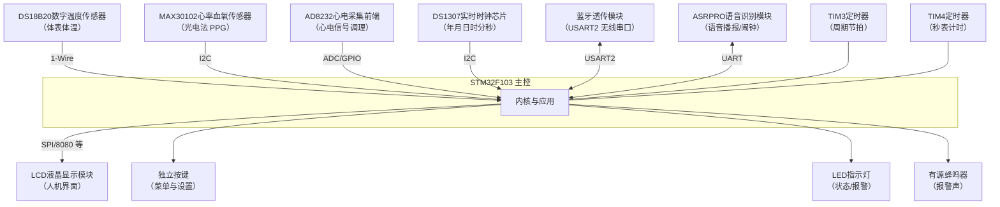
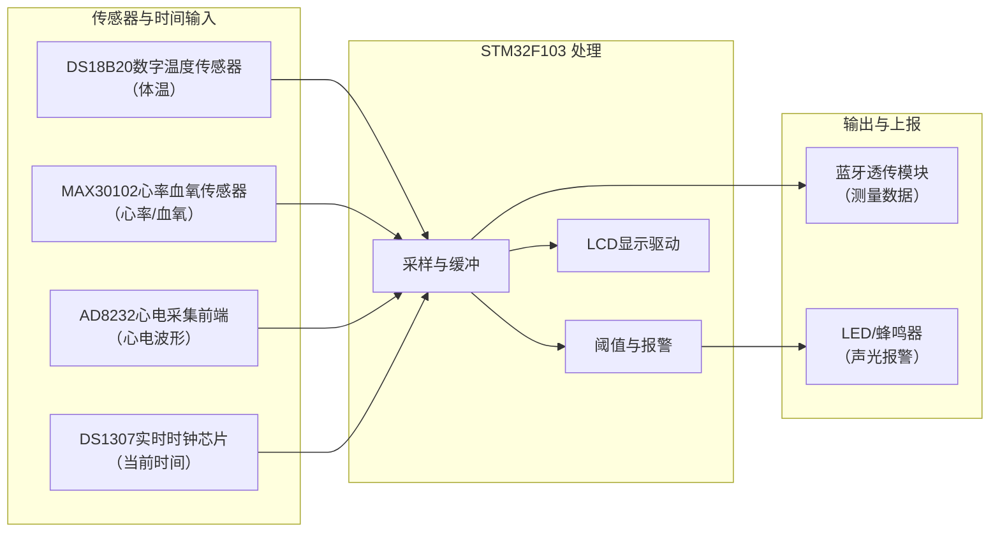
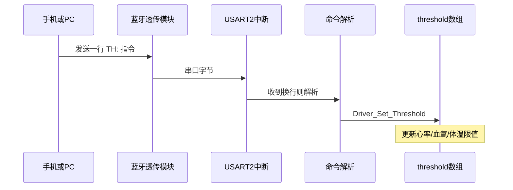
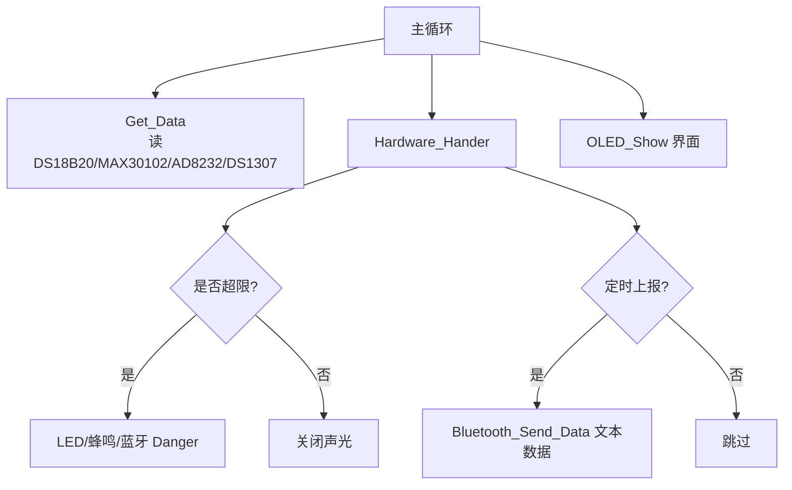
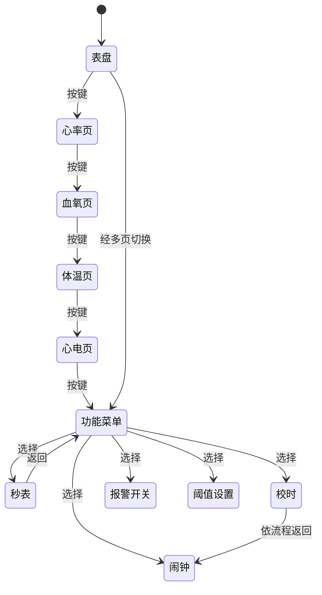
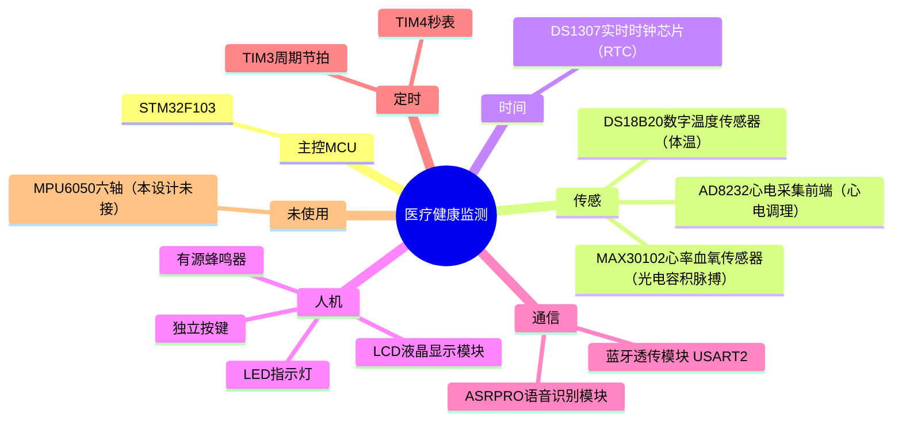
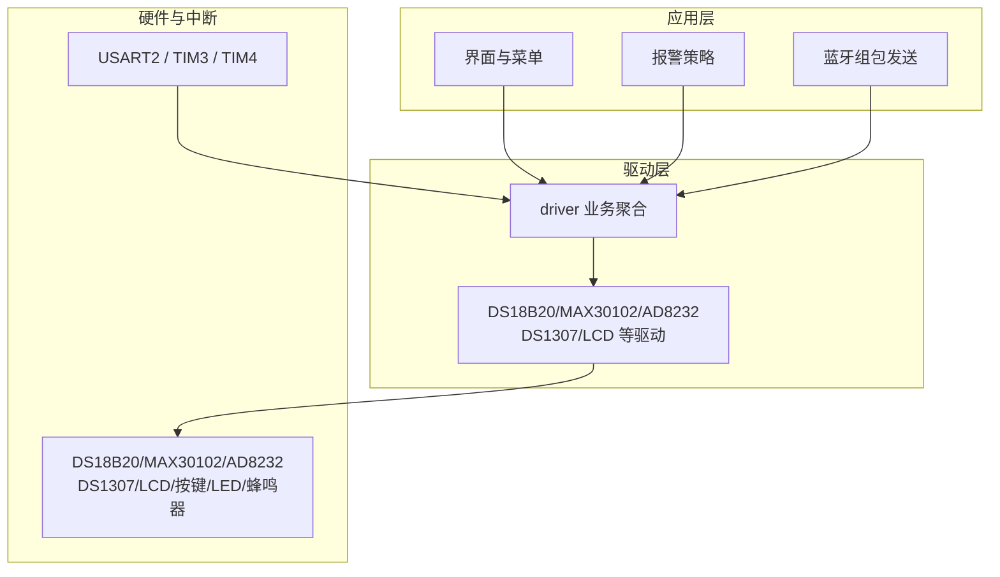

# 医疗健康监测设备 — 系统框图（文字版）

说明：以下均为文字描述结构关系；本设计**未使用 MPU6050**。

---

## 一、硬件总体结构

中心为 **STM32F103 主控**。其外围可分为四类：

**1）生理与环境传感（输入到 MCU）**

- **DS18B20**：单总线数字温度，用于体温。
- **MAX30102**：光电方式，用于心率与血氧。
- **AD8232**：心电前端 + ADC 采样，用于心电波形与数值。

**2）时间与人机交互**

- **DS1307**：I2C 实时时钟，提供年月日时分秒。
- **LCD**：显示界面、波形、菜单与中文提示。
- **按键**：切换界面、调整参数、确认等。
- **LED**：状态指示（含报警时闪烁等逻辑）。
- **蜂鸣器**：报警发声。

**3）定时**

- **TIM3**：周期节拍（如报警闪烁计数、蓝牙发送节拍等，与主程序配合）。
- **TIM4**：秒表计时用节拍。

**4）通信与语音**

- **蓝牙模块**：经 **USART2** 与 MCU 连接，上行发送测量数据，下行可接收 **TH:** 类阈值指令。
- **ASRPRO**：语音模块，与 MCU 有数据交互（闹钟提示音、语音相关命令等，以工程实际接线为准）。

传感器与 RTC、按键为 MCU **输入**；LCD、LED、蜂鸣器为 MCU **输出**；蓝牙与语音模块为 **双向** 数据。

---

## 二、数据与业务关系（文字）

**采集侧**

- 体温来自 DS18B20；心率、血氧来自 MAX30102；心电采样来自 AD8232；当前时间来自 DS1307。

**主控内处理**

- **界面**：按按键切换表盘、心率页、血氧页、体温、心电波形、菜单及设置类页面；时间显示依赖 DS1307。
- **报警**：将心率、血氧、体温与预设阈值比较，超限时驱动 LED、蜂鸣器，并可经蓝牙发送报警信息。
- **蓝牙上报**：周期性把体温、心率、血氧及心电相关采样缓冲等以文本形式发到上位机。

**上位机 / 手机**

- 通过串口（经蓝牙透传）接收设备数据；可向设备发送 **TH:** 格式指令，用于修改各项阈值（与程序中 `Driver_Set_Threshold` 等一致）。

**心电波形**：以采样值送显示模块滚动绘制，与阈值报警可并行存在。

---

## 三、明确不包含的部分

- **MPU6050**：本设计未使用，不在上述结构中出现。
- **电源、复位、晶振**：属于 MCU 最小系统，可按原理图单独列出，此处不展开。

---

## 四、结构一览（缩进表示从属）

```
STM32F103 主控
├── 传感：DS18B20（体温） / MAX30102（心率、血氧） / AD8232（心电）
├── 时间：DS1307（RTC）
├── 显示与操作：LCD / 按键 / LED / 蜂鸣器
├── 定时：TIM3 / TIM4
└── 通信：蓝牙（USART2） / ASRPRO 语音模块
```

上位机通过蓝牙与 MCU 通信：读数据、下发阈值指令。

---

## 五、Mermaid 图示（多种类型）

框内文字采用 **「型号 + 作用」**（与工程器件一致；**非 DHT11**，本设计为 **DS18B20** 测体温）。详细分段可复制 **`框图代码_分段.md`**。

### 1）硬件拓扑（flowchart，自上而下）



### 2）数据流（flowchart LR，左→右）



### 3）蓝牙阈值指令交互（sequenceDiagram）



### 4）主循环业务分工（flowchart，带分支）



### 5）界面状态简图（stateDiagram-v2）



### 6）硬件分类（mindmap）



### 7）分层架构（graph TB + subgraph）



---

> 若某预览器不支持 `mindmap`，可删除第 6 节或改用第 1、2 节 flowchart。
